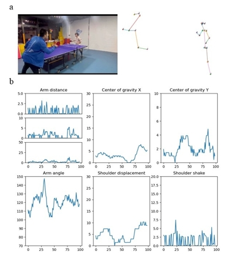

## Official Code of Table Tennis Coaching System Based on a Multimodal Large Language Model with a Table Tennis Knowledge Base


[中文](README_CN.md)

### Environment Setup

This project relies on the `conda` environment management tool to ensure consistency and compatibility of package versions. Please follow the steps below to configure and activate the project environment.

#### 1. Install `conda`

If you haven't installed `conda` yet, please visit the [Anaconda official website](https://www.anaconda.com/) or the [Miniconda official website](https://docs.conda.io/en/latest/miniconda.html) for installation guides, and complete the installation according to your operating system.

#### 2. Prepare the `env.yaml` file

Ensure there is an `env.yaml` environment configuration file in the root directory of the project. This file defines all the dependencies required by the project and their version information.

#### 3. Create and configure the environment

Use the following command to create a new conda environment based on the `env.yaml` file:

```bash
conda env create -f env.yaml
```

This command will install the versions of the dependencies listed in `env.yaml` and create a new conda environment.

#### 4. Activate the environment

Once created, you can activate the environment with the following command:

```bash
conda activate tt-llm
```

After activation, the terminal prompt will display the current environment name, indicating that the environment has been successfully activated.

#### 5. Verify the environment

To ensure the environment is correctly configured and activated, you can use the following command to view the current conda environment:

```bash
conda info --envs
```

After activating the environment, all dependency packages of the project should be available, and you can now start using the code in the project.

### 1_init_video: Video Frame Browsing and Clipping Tool

#### Introduction

This script is used for frame-by-frame browsing of videos and clipping video segments based on user-selected start and end points.

#### Usage

Run the following command in the terminal:

```bash
python 1_init_video.py --vpath <video_path> --name <output_name>
```

- `<video_path>`: Path to the video file.
- `<output_name>`: Prefix for the name of the clipped video.

#### Keyboard Operations

- `1/2`: Advance/rewind 1 frame
- `3/4`: Advance/rewind 4 frames
- `5/6`: Advance/rewind 30 frames
- `s`: Save the current frame as the start point
- `e`: Save the current frame as the end point
- `n`: Display the current frame number
- `ESC`: Exit and save the video clip

Clipped segments will be saved in the format `<output_name>_number.avi`.

### 2_openpose.ps1 Script - Usage Instructions

#### Purpose

This PowerShell script is used to automatically process `.avi` format video files and use OpenPose to extract human pose estimation results, outputting the results in JSON format to a specified directory.

#### Prerequisites

- OpenPose is installed, and `OpenPoseDemo.exe` is located in the `bin` folder.
- The `.avi` files to be processed are stored in a specified data directory.

#### Main Variables

- `$openPoseDemoPath`: Path to the OpenPose executable (`OpenPoseDemo.exe`).
- `$dataDir`: Directory path where `.avi` video files are stored (e.g., `C:\project\data`).

#### Script Execution Steps

1. **Set Encoding:** Set to use UTF-8 encoding to ensure correct handling of console output.

2. **Change Directory to OpenPose:** The script navigates to the `openpose` directory to perform related operations.

3. **Process Each `.avi` File:**
   
   - Scan for `.avi` files in the specified directory `$dataDir`.
   - For each video file found:
     - Create a subdirectory named after the file (excluding the extension) in the data directory.
     - Use OpenPose's `--video` parameter to process the video and output pose estimation results in JSON format to the newly created subdirectory.
     - To speed up processing, OpenPose's display and rendering features are disabled (`--display 0 --render_pose 0`).
     - After processing each video file, the script pauses for 60 seconds before processing the next one.

4. **Completion Notice:** After all video files are processed, the script displays "all ok".

#### How to Run

1. Ensure the video files to be processed are placed in the `$dataDir` path (e.g., `C:\project\data`).

2. Open PowerShell and navigate to the directory where the script (`2_openpose.ps1`) is stored.

3. Run the following command to start the script:

```ps
.\2_openpose.ps1
```

4. The processing results for each video file will be stored in subdirectories within `$dataDir`, with each subdirectory named after the corresponding video file.

#### Customization

- **Change Data Directory:** You can modify the `$dataDir` variable to point to the directory containing your `.avi` files.
- **Adjust OpenPose Parameters:** You can add or modify OpenPose options in `$openPoseCommand` to customize the output of pose estimation.

### 3_action_recognition - Usage Instructions

The script `3_action_recognition.py` is used to process video frames, analyze human keypoint data, extract action features, and generate various action-related image outputs. The code functions are divided into several main steps:

#### Parameters

The script accepts two command-line parameters:

- `--vpath`: Path to the video file (string type)
- `--fpath`: Path to the folder containing JSON files (string type)

Example run:

```bash
python 3_action_recognition.py --vpath "/path/to/video.mp4" --fpath "/path/to/json/folder"
```

#### Function Description

1. **`get_output_path(input_path)`**  
   Generates the output file path for the processed video.

2. **`find_people(folder_path)`**  
   Reads JSON files from the specified folder, parses keypoint data of human poses, draws body keypoints, and allows the user to select a person to process.

3. **`openpose_data_get(folder_path, right_shoulder_select)`**  
   Iterates through JSON files in the folder, calculating keypoint data of the person closest to the selected human keypoints in each frame.

4. **`calculate_angle(p1, p2, p3)`**  
   Calculates the angle formed by three points (e.g., shoulder, elbow, wrist).

5. **`triangle_centroid(point1, point2, point3)`**  
   Calculates the centroid of the triangle formed by three points.

6. **`calculate_s_angle(r_shoulder, l_shoulder)`**  
   Calculates the slope angle between two points (e.g., left and right shoulders).

7. **Drawing and Calculating Images**
   
   - The script analyzes action angles, distances, etc., and generates and saves images such as arm angle changes, shoulder movement, centroid changes, etc.
   - Each image is saved in the specified folder, such as `arm_vector.jpg`, `arm_angle.jpg`, `bcx.jpg`, `bcy.jpg`, etc.

8. **Video Frame Capture**  
   The script captures a frame from the video based on the analysis results and crops the image according to the calculated keypoint positions. Cropped images like `paddle.jpg`, `people.jpg` are saved to the specified folder.

#### Output

The script outputs several analysis result images and video frame capture images after action feature analysis in the specified folder.

### 4_table_tennis_trace.py - Usage Instructions

#### Function Description

This script is used to detect and track object trajectories from a video, especially suitable for trajectory detection of sports like table tennis. The script uses image processing techniques such as background subtraction and blob detection to extract object trajectories and visualize outputs.

#### Command-Line Parameters

The script supports passing the video file and output folder paths via command-line arguments.

- `--vpath`: Video file path
- `--fpath`: Output folder path

#### Usage

When running the script, provide the path to the video file and the output folder path:

```bash
python 4_table_tennis_trace.py --vpath /path/to/video.mp4 --fpath /path/to/output_folder
```

For example:

```bash
python 4_table_tennis_trace.py --vpath ./videos/sample.mp4 --fpath ./output
```

#### Workflow

1. **Read Video**: Use OpenCV to open the video file, read the frame dimensions, and initialize the background subtractor.

2. **Background Subtraction**: Perform background subtraction on each frame of the video, generate mask images, apply Gaussian blur, and save the processed frames as a new video file.

3. **Blob Detection**: Use the `blob_log` method to detect object trajectories in the video, mainly using Otsu thresholding and connected component labeling to extract object shapes and positions.

4. **Trajectory Visualization**: After processing all frames, the script generates a scatter plot of the object's motion trajectory, labels each point's index, and provides color gradients to indicate motion time.

5. **User Interaction**:
   
   - Users can input start and end points to extract trajectory data within a specific range for plotting.
   - Users can choose the trajectory points to retain and generate and save the final trajectory image.

#### Output

- Processed video file (mask video): A video with the filename containing `_mask` is generated in the input video's directory.
- Trajectory image: After processing the trajectory, the trajectory image is saved as `pptrace.jpg` in the directory specified by the `--fpath` argument.

#### Notes

- Ensure the video file path and output folder path are correct.
- Video processing may take a long time, especially when the video has many frames.

### 5_knowledge_base.py - Usage Instructions

#### Function Overview

This script is used to extract questions and answers from a given raw knowledge base file, obtain text embeddings of the questions by calling a specified API, and save this information as a structured CSV file for subsequent knowledge base queries and management.

#### Steps

1. **Parameter Description**:
   When running the script, the following parameters need to be passed:
   
   - `--api_key`: API key for accessing the API.
   - `--base_url`: Base URL of the API (e.g., `api.openai.com`).
   - `--path_raw_kb`: Path to the raw knowledge base file, which should store questions and answers in a specific format.
   - `--path_save_kb`: Path to save the generated knowledge base file (CSV format).

2. **File Format**:
   The raw knowledge base file should be written in the following format:
   
   ```
   Q1: Question 1
   A1: Answer 1
   Q2: Question 2
   A2: Answer 2
   ...
   ```

3. **Example Run**:
   Run the script in the terminal:
   
   ```bash
   python 5_knowledge_base.py --api_key "your_api_key" --base_url "api.openai.com" --path_raw_kb "raw_kb.txt" --path_save_kb "processed_kb.csv"
   ```

4. **Script Workflow**:
   
   - Read the specified raw knowledge base file and extract questions and answers.
   - Call the specified API to obtain text embeddings of the questions.
   - Store the questions, answers, and their embedding vectors as a CSV file for later use.

#### Notes

- Ensure the API key is valid and can access the specified API base URL.
- The input knowledge base file must meet the format requirements; otherwise, parsing may fail.

### 6_llm_ttcoach.py - Usage Instructions

This program provides a table tennis coaching function using a large language model (LLM). Users can input different parameters, make API requests to the model, generate personalized prompts, and perform error analysis combined with images.

#### Parameter Details

1. **`--api_key`** (string, **required**)
   
   - **Description**: Your API key for authenticating and authorizing access to the large language model service.
   - **Use**: The program communicates with the API through this key to ensure you have permission to call the model.
   - **Example**: `--api_key your_api_key_here`

2. **`--base_url`** (string, **required**)
   
   - **Description**: The base URL of the API, i.e., the server address.
   - **Use**: Specifies which server the program should connect to access the model service.
   - **Example**: `--base_url api.example.com`

3. **`--model`** (string, **required**)
   
   - **Description**: The name of the model to use.
   - **Use**: Select a specific version of the large language model, such as `gpt-4-turbo`.
   - **Example**: `--model gpt-4-turbo`

4. **`--fpath`** (string, **required**)
   
   - **Description**: Path to the working folder.
   - **Use**: Specifies the directory where the files and images needed for the program run are located.
   - **Example**: `--fpath /path/to/your/workfolder`

5. **`--type`** (integer, range **1-8**, **required**)
   
   - **Description**: Error type number, used to select the type of error to analyze.
   - **Use**: The program calls the corresponding error analysis function based on this type.
   - **Example**: `--type 3`

6. **`--kb_file`** (string, **required**)
   
   - **Description**: Path to the knowledge base file.
   - **Use**: Provides a knowledge base file containing common questions and answers, enriching the model's reference information.
   - **Special Value**: If no knowledge base is needed, it can be set to `'0'`.
   - **Example**: `--kb_file /path/to/knowledge_base.csv` or `--kb_file 0`

7. **`--pdict`** (string, **required**)
   
   - **Description**: Path to the Prompt dictionary file, usually a pickle-serialized dictionary file.
   - **Use**: Stores prompt templates corresponding to different error types, and the program extracts the corresponding Prompt based on the error type.
   - **Example**: `--pdict /path/to/prompt_dict.pkl`

8. **`--ext`** (string, *optional*, default value `''`)
   
   - **Description**: Additional content, which can be any extra information to be passed to the model.
   - **Use**: When generating prompts, replaces the `$ext` placeholder in the Prompt template, adding custom information.
   - **Example**: `--ext "Please pay special attention to grip posture"`

#### Usage Example

```bash
python 6_llm_ttcoach.py \
  --api_key your_api_key_here \
  --base_url api.example.com \
  --model gpt-4-turbo \
  --fpath /path/to/your/workfolder \
  --type 3 \
  --kb_file /path/to/knowledge_base.csv \
  --pdict /path/to/prompt_dict.pkl \
  --ext "additional information"
```

#### Parameter Usage Details

- **`--api_key`**
  
  Your API key obtained from the model provider. This key is used to authenticate your identity and permissions, ensuring you can access and call the model service. Please keep it safe to avoid leaks.

- **`--base_url`**
  
  The base URL of the model API, specifying the server address the program should connect to. Usually provided by the model provider, possible formats include `api.openai.com`.

- **`--model`**
  
  The specific model name to use. Different models may have different functions and performance, such as `gpt-3.5-turbo`, `gpt-4-turbo`, etc. Please choose the appropriate model according to your needs.

- **`--fpath`**
  
  The path to the working folder containing all the files and images needed for the program run. The program will look for specific image files in this directory, such as:
  
  - `arm_vector.jpg`
  - `paddle.jpg`
  - `pptrace.jpg`
  - Other images required by the error type
  
  Please ensure these files exist in the specified directory and that the file names match those called in the program.

- **`--type`**
  
  Specifies the error type to analyze, with a value of an integer from 1 to 8. Each number corresponds to a specific technical error, and the program will call the corresponding analysis function based on this type.

- **`--kb_file`**
  
  The path to the knowledge base file, usually a CSV file containing the following columns:
  
  - `index`: Index number of the question
  - `question`: Common question
  - `answer`: Corresponding answer
  - `embedding`: Embedding vector of the question
  
  The program will load this file and use the embedding vectors for similarity calculations to retrieve knowledge related to the current analysis. If no knowledge base is needed, this parameter can be set to `'0'`.

- **`--pdict`**
  
  The path to the Prompt dictionary file containing prompt templates corresponding to different error types. The program uses the `pickle` library to load this file and extract the corresponding Prompt based on the `--type` parameter for generating requests.

- **`--ext`**
  
  Additional content that can be used to pass extra information or context to enhance the model's understanding. In the Prompt template, `$ext` will be replaced with the value of this parameter.

#### Program Workflow

1. **Parameter Parsing**: The program first uses the `argparse` module to parse command-line parameters, obtaining the configuration information needed for the run.

2. **Load Prompt Dictionary**: Use the `pickle` library to load prompt template data from the file specified by `--pdict`.

3. **Knowledge Base Loading and Processing (Optional)**:
   
   - If `--kb_file` is provided, the program will load the knowledge base file and extract embedding vectors.
   - Generate the embedding vector for the current input using the model, and calculate similarity with the vectors in the knowledge base to retrieve the most relevant Q&A pairs.

4. **Image Encoding**:
   
   - Load the required image files from the directory specified by `--fpath`.
   - Use `base64` encoding to convert images to string form, preparing them for sending to the model.

5. **Error Analysis**:
   
   - Call the corresponding error analysis function (`get_error_1` to `get_error_8`) based on the error type specified by `--type`.
   - The function will assemble the request message, including text content and image data.
